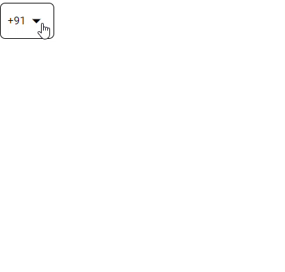

# country-code-picker

Angular country code picker for form field [source](https://github.com/venkatesh-babu/country-code-picker.git)

## Live example

 </a>

## Getting started

### Step 1: Install `angular material`:

##### NPM

```shell
ng add @angular/material
```

### Step 2: Install `country-code-picker`:

##### NPM

```shell
npm install country-code-picker
```

### Step 3: Import the countryCodeComponent

**`popup.component.ts`**

```typescript
import { countryCodeComponent } from "country-code-picker";

@Component({
  selector: "app-popup",
  standalone: true,
  imports: [RouterOutlet, countryCodeComponent],
  templateUrl: "./popup.component.html",
  styleUrl: "./popup.component.scss",
})
export class AppComponent {
  actionSelectEvent(event: any) {
    console.log(event);
  }
}
```

### Step 4: implement in html

**`popup.component.html`**

```html
<country-code-field displayValue="dial_code" defaultValue="+91" (actionSelectEvent)="actionSelectEvent($event)"></country-code-field>
```

## API

### Inputs

| Input        | Type   | Default     | Required | Description                                         |
| ------------ | ------ | ----------- | -------- | --------------------------------------------------- |
| displayValue | string | 'dial_code' | no       | Text for display value that display in select field |
| defaultValue | string | '+91'       | no       | default value to be selected                        |

### Outputs

| Output            | Description                                        |
| ----------------- | -------------------------------------------------- |
| actionSelectEvent | event will called when an country code is selected |

## Changelog

### 1.0.0

- Release July 27, 2024

### 1.1.2 - added repos

- Release July 28, 2024
